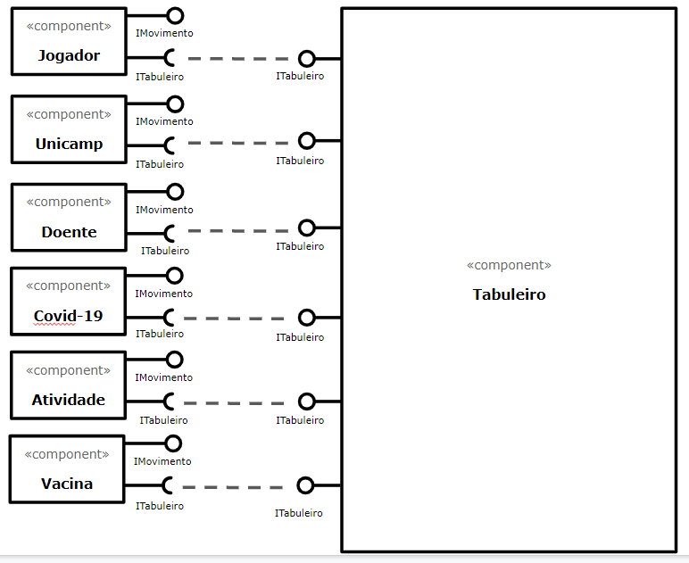
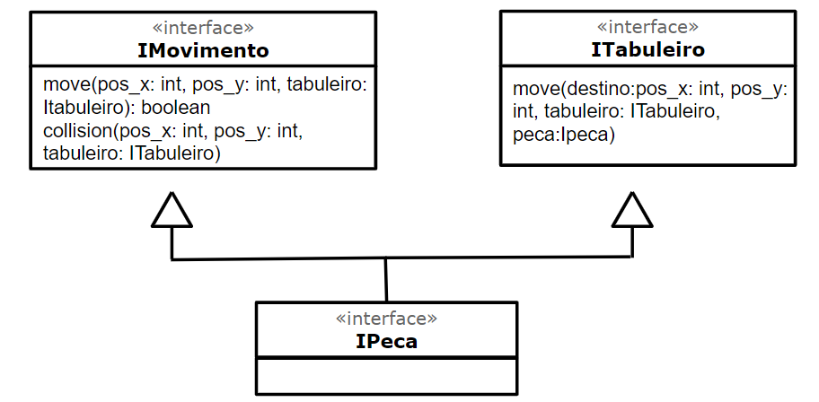
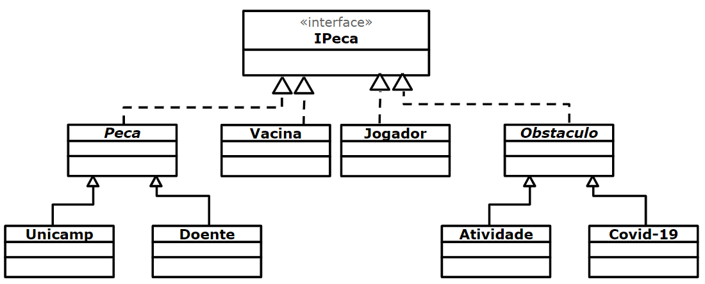

# Projeto EaD Corona Run

# Equipe
* Vitor Rodrigues Pietrobom - 245584
* Guilherme Tezoli Bakaukas - 217332

# Descrição Resumida do Projeto
O projeto consiste num jogo feito em espaco celular baseado em turnos.

O jogo tem como personagens um jogador e dois antagonistas, a Unicamp e um doente, sendo que a primeira solta atividades e o segundo solta corona virus.

A cada turno o jogador pode realizar um movimento e os antagonistas e personagens se movem,

# Vídeo do Projeto

# Diagrama Geral de Componentes

Este é um diagrama inicial do jogo proposto:

Diagrama de herança das interfaces:

Diagrama geral:

Para cada componente será apresentado um documento conforme o modelo a seguir:

# Componente `<Nome do Componente>`

## Interfaces

Interfaces associadas a esse componente:

Campo | Valor
----- | -----
Classe | `<caminho completo da classe com pacotes>`   Exemplo: `pt.c08componentes.s20catalog.s10ds.DataSetComponent`
Autores | `<nome dos membros que criaram o componente>`
Objetivo | `<objetivo do componente>`
Interface | `<interface em Java do componente>`
~~~
public interface ITableProducer {
  String[] requestAttributes();
  String[][] requestInstances();
}
public interface IDataSource {
  public String getDataSource();
  public void setDataSource(String dataSource);
}
public interface IDataSet extends ITableProducer, IDataSource {
}
~~~

## Detalhamento das Interfaces

### Interface `<nome da interface>`
`<papel da interface>`.

Método | Objetivo
-------| --------
`<id do método em Java>` | `<objetivo do método e descrição dos parâmetros>`

## Exemplo:

### Interface `ITableProducer`

Interface provida por qualquer fonte de dados que os forneça na forma de uma tabela.

Método | Objetivo
-------| --------
`requestAttributes` | Retorna um vetor com o nome de todos os atributos (colunas) da tabela.
`requestInstances` | Retorna uma matriz em que cada linha representa uma instância e cada coluna o valor do respectivo atributo (a ordem dos atributos é a mesma daquela fornecida por `requestAttributes`.

### Interface `IDataSetProperties`

Define o recurso (usualmente o caminho para um arquivo em disco) que é a fonte de dados.

Método | Objetivo
-------| --------
`getDataSource` | Retorna o caminho da fonte de dados.
`setDataSource` | Define o caminho da fonte de dados, informado através do parâmetro `dataSource`.
